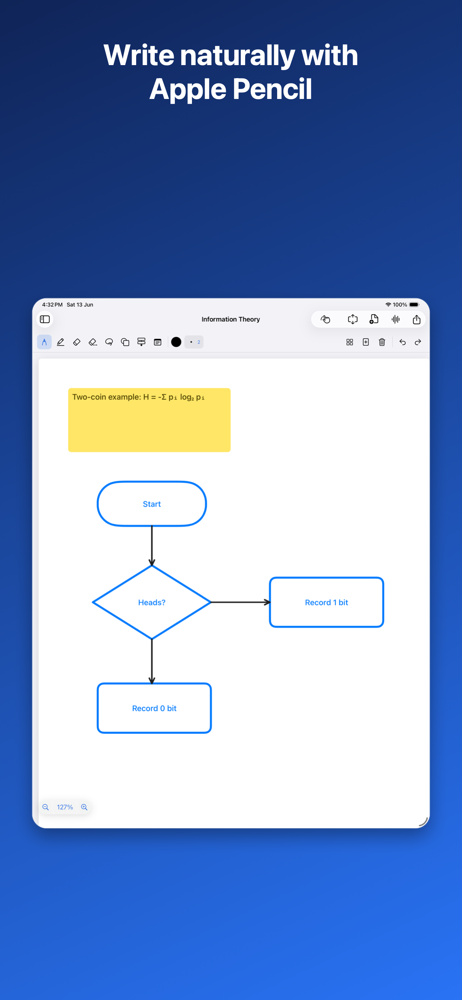
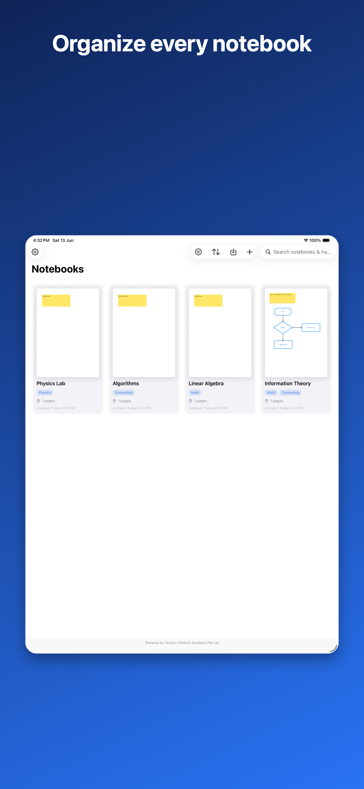

# NotePad — Native Apple Note-Taking App

A clean, native note-taking app optimized for Apple Pencil, with a
**GoodNotes-style** editor: a compact horizontal tool bar, combinable paper
surfaces & patterns, handwriting, a full shapes & flowcharts library, PDF
annotation, and notebook organization with tags — all synced across devices via
iCloud. **Universal**: edit on iPad with the Apple Pencil, and **review your
notes on iPhone and Mac** (view-only, so they can't be altered by accident).

Published on the App Store as **Tertiary NotePad**, by **Tertiary Infotech
Academy Pte Ltd**.


<p align="center">
  <a href="https://apps.apple.com/us/app/tertiary-notepad/id6779909944">
    
  </a>
</p>

<p align="center">
  📱 <a href="https://apps.apple.com/us/app/tertiary-notepad/id6779909944"><strong>Download on the App Store</strong></a>
  &nbsp;·&nbsp;
  💻 <a href="https://github.com/alfredang/notepadapp"><strong>Source on GitHub</strong></a>
</p>

<p align="center">
  
  &nbsp;&nbsp;
  
</p>

<p align="center">
  <sub>Screenshots from the <a href="https://apps.apple.com/us/app/tertiary-notepad/id6779909944">App Store listing</a>.</sub>
</p>

## Features

### Editor (GoodNotes-style)
- **Compact horizontal tool bar** at the top: tools, color, width, template,
  add-page, clear/delete, and undo/redo — all in one clean, icon-centric row.
- **Apple Pencil** — PencilKit canvas with pressure, tilt and low latency.
  **Palm rejection**: scrolling is suspended while the Pencil draws.
- **Pencil draws, finger scrolls** (the GoodNotes model); a single finger pans
  and two fingers always pinch-zoom. Finger-drawing is an opt-in toggle/setting.
- **Hold-to-straighten** — draw a line and hold the Pencil still at the end; the
  wobbly stroke snaps to a clean straight segment (with a haptic tick).
- **Tools** — pen (8 widths), highlighter, pixel & object erasers, plus a
  **color dropdown** with 26 swatches and a custom color picker.
- **Shapes (14)** — rectangle, rounded rectangle, circle, triangle, right
  triangle, diamond, pentagon, hexagon, star, parallelogram, trapezoid, line,
  arrow, double-arrow — an editable **vector overlay** (stroke / fill / width)
  shown in an icon grid whose previews are drawn with the real geometry.
- **Flowcharts (14)** — process, decision, terminator, data, document,
  predefined process, database (cylinder), manual input/operation, preparation,
  connector, card, off-page connector, and a flow arrow. Nodes carry editable
  labels; connectors **snap to nodes** and re-route automatically when moved.
- **Inline text** — type **directly into** sticky notes and flowchart nodes with
  a multi-line editor; pick a **background color** (text auto-contrasts), tap a
  node to edit, tap away to commit. Node text is centered.
- **Lasso** — loop around **multiple** handwriting strokes to move / delete /
  copy (native PencilKit); tap a shape to select it for an on-canvas popup
  (delete · duplicate · change color) and drag to move.

### Templates & appearance
- **Surface × Pattern** — two independent axes that combine: a **surface**
  (Whiteboard · Paper / warm cream · Blackboard) and a **pattern** overlay
  (Blank · Lined · Dotted · Grid). Any surface works with any pattern (e.g.
  Blackboard + Grid), and the pattern color adapts so it stays visible on dark
  surfaces. New notebooks default to **Portrait · Blackboard · Blank**.
- **Layout** — switch a notebook between **Portrait** and **Landscape**; pages
  resize live and the view re-fits.
- Templates apply **notebook-wide**; switching surface recolors existing ink
  (dark ink ⇄ white chalk) and new pages inherit the template.
- **Adaptive light/dark** — ink renders literally on the page (and in
  thumbnails), while chrome and the canvas surround follow the system theme.
- **Page footer** — "Page N · date & time" at the bottom-right (toggleable).

### Pages
- **Continuous paging** — pull firmly past the top/bottom edge and release to add
  a page above/below; or use the **Add Above / Add Below** menu.
- **Smart fit** — fills the width in portrait and fits the **whole page** in
  landscape (or on landscape pages) so nothing overflows; re-fits on rotation.
  **Double-tap** a page to zoom in / out.
- **Page-jump chevrons** — floating ⌃ / ⌄ buttons (bottom-right) jump straight to
  the first / last page.
- **Thumbnail sidebar** — jump to a page, **multi-select to delete**, and
  **drag-to-reorder**; thumbnails render the real content in the page's colors.
- **Infinite canvas** — extend a page in A4-height increments.

### Organization & sync
- **Bottom navigation** — a tab bar with **Notebooks**, **Favorites** (starred
  notebooks), **Feedback** (message support on WhatsApp), and **About**.
- **Dashboard** — grid of notebooks with live cover thumbnail, page count,
  dates, instant search (incl. handwriting), and sort.
- **Favorites** — star any notebook from its card to pin it in the Favorites tab.
- **Tags** — assign multiple tags (e.g. Physics, Math, Computing) to a notebook;
  filter the dashboard by tag. Tags show as chips under the title.
- **Nested notebooks** — sub-notebooks via a self-referential relationship.
- **iCloud sync** — notebooks and pages auto-sync via CloudKit (private database).
- **Handwriting / OCR search** — Vision text recognition indexes pages so search
  finds words inside your handwriting and shapes.
- **Auto save** — every change is debounced and persisted; no save button.

### Import / export / media
- **PDF annotation** — import a PDF as annotatable pages and mark it up.
- **Export** — page to PNG / JPG / PDF; whole notebook to a combined PDF.
- **Notebook sharing** — export a full notebook (pages, PDF backgrounds, voice
  memos) to a portable `.notebook` file and import it elsewhere.
- **Audio notes** — record, play back, and delete voice memos per notebook.

### Multi-device (iPad · iPhone · Mac)
- **iPad** — the editing device: full Apple Pencil drawing, the complete tool
  bar, and the inline thumbnail sidebar. Its layout is the reference experience.
- **iPhone** — a **view-only** companion tuned for compact screens: the sidebar
  becomes a slide-up sheet and the tool bar scrolls horizontally. The canvas is
  read-only (scroll & zoom), so a stray finger never marks up a note.
- **Mac** — runs natively via **Mac Catalyst**, **view-only**, great for
  reviewing notes on a big screen with trackpad scroll/zoom.
- **One iCloud library** — the same CloudKit notebooks appear everywhere.

### iPad-native polish
- **Keyboard shortcuts** — Undo ⌘Z, Redo ⌘⇧Z, New notebook ⌘N, Settings ⌘,.
- **Pointer hover effects** on toolbar and cards; **VoiceOver labels** on all
  icon-only controls (per Apple's iPad Human Interface Guidelines).

## Tech Stack

- **SwiftUI** + **PencilKit** + **PDFKit** + **Vision** (OCR) + **AVFoundation** (audio)
- **SwiftData** persistence with **CloudKit** iCloud sync
- **Swift 6** language mode with **complete strict concurrency**
- **Observation** framework (`@Observable`), `@MainActor` isolation
- **MVVM** + **Repository** pattern
- **Universal**: iPadOS / iOS **18+** and **macOS** (Mac Catalyst)

## Architecture

```
SwiftUI Views ──> ViewModels (@Observable) ──> Repositories ──> SwiftData ──> CloudKit
                       │
                       ├─> AutoSaveService (debounced save + Vision OCR indexing)
                       ├─> ExportService / NotebookArchiveService (PDF, PNG, .notebook)
                       └─> AudioRecorder / PDFImport services

Editor = zoom/pan UIScrollView
         └─ vertical stack of PageContainerViews (height = N × A4)
              ├─ background image  (imported PDF page)
              ├─ PKCanvasView      (handwriting / drawing, pencil-only)
              └─ ShapeOverlayView  (vector shapes, flowchart connectors, sticky notes)
```

The gesture conflict between drawing, panning and zooming is resolved with a
finger-only scroll pan and `drawingPolicy = .pencilOnly`: the Apple Pencil always
draws (and scrolling is suspended mid-stroke for palm rejection), a single finger
scrolls, and two fingers pinch-zoom — while each canvas's internal scrolling is
disabled so the single outer scroll view owns pan/zoom.

## Project Layout

```
App/          App entry (CloudKit container), root view, theme, entitlements
Models/       Notebook, Page, AudioNote (SwiftData), CanvasItem/Shape (Codable overlay)
ViewModels/   Dashboard / Notebook / Editor view models, tool + canvas controllers
Services/     Repositories, AutoSave (+OCR), Export, NotebookArchive, PDFImport,
              TextRecognition (Vision), Audio, PageRenderer, PaperPattern,
              StrokeStraightener
PencilKit/    CanvasContainerView (scroll + zoom host), HoldStillGestureRecognizer
Components/   PageContainerView, ShapeOverlayView, ShapePath, ThumbnailView,
              PaletteGlyphs (shape/paper menu previews)
Views/        Dashboard, Notebook, Editor, Sidebar, Toolbar, Settings, Export, AudioNotes
```

## Building

The Xcode project is generated from `project.yml` with
[XcodeGen](https://github.com/yonsm/XcodeGen) (the `.xcodeproj` is **not** checked in).

```bash
brew install xcodegen      # once
xcodegen generate          # creates NotePadApp.xcodeproj
open NotePadApp.xcodeproj
```

Select an **iPad / iPhone (18+) simulator**, a physical device, or **My Mac
(Mac Catalyst)** and press **Run**. The iPad is the editing device; iPhone and
Mac open notebooks in view-only mode.

### Command-line build

```bash
xcodegen generate
xcodebuild -project NotePadApp.xcodeproj -scheme NotePadApp \
  -sdk iphonesimulator -destination 'generic/platform=iOS Simulator' \
  CODE_SIGNING_ALLOWED=NO build
```

## Continuous Integration

`.github/workflows/build.yml` runs on every push / PR to `main`: it installs
XcodeGen, generates the project, and compiles for the iOS Simulator on a macOS runner.

## Roadmap

**Shipped:** GoodNotes-style top toolbar · handwriting with pressure/tilt ·
hold-to-straighten lines · 14-shape & 14-component flowchart libraries with
snapping connectors · **Surface × Pattern** templates (Whiteboard/Paper/
Blackboard × Blank/Lined/Dotted/Grid, notebook-wide with ink recolor) ·
**Portrait / Landscape** layout · inline multi-line text + element background
colors · multi-stroke lasso · long-press to edit/recolor/delete sticky notes ·
iCloud (CloudKit) sync · handwriting / OCR search · audio (voice-memo) notes ·
infinite extendable canvas · page-jump chevrons · PDF import & annotation ·
`.notebook` sharing · notebook tags & filtering · pull-to-add pages · double-tap
zoom · multi-select / drag-reorder pages · **universal app** (iPad editor;
iPhone & Mac view-only) · iPad HIG polish (keyboard shortcuts, pointer hover,
VoiceOver). On the App Store.

**Next:** real-time collaboration (live CKShare co-editing — current sharing is
file-based) · handwriting-to-text conversion · editing on iPhone/Mac · web
companion.

---

<p align="center">Powered by <strong>Tertiary Infotech Academy Pte Ltd</strong></p>
